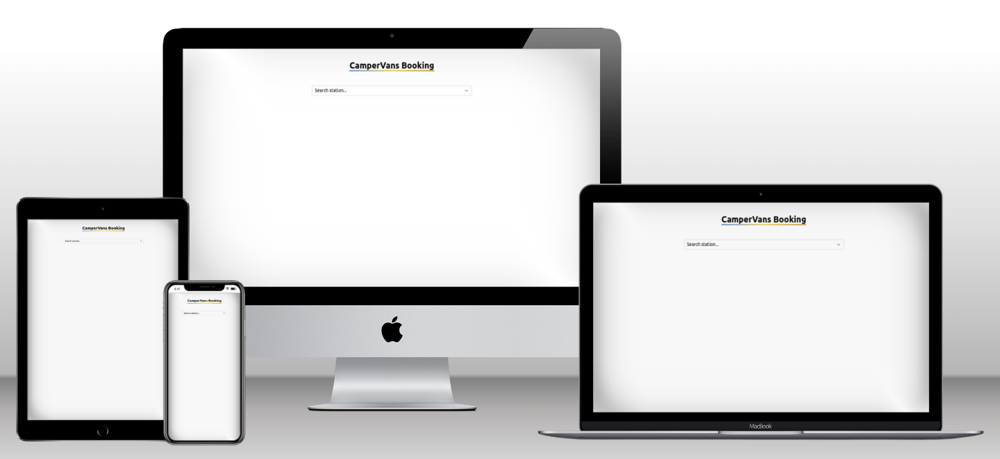
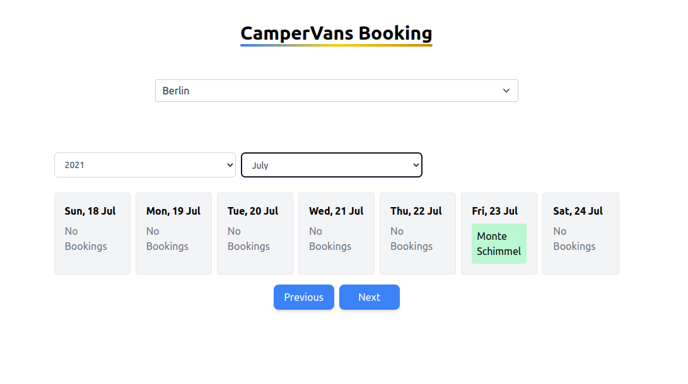
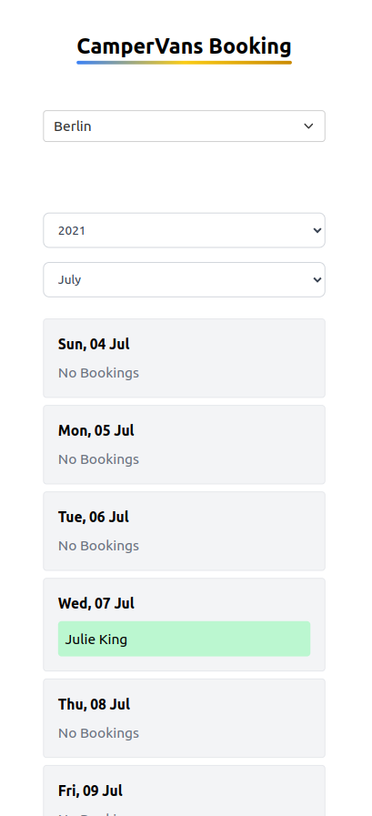
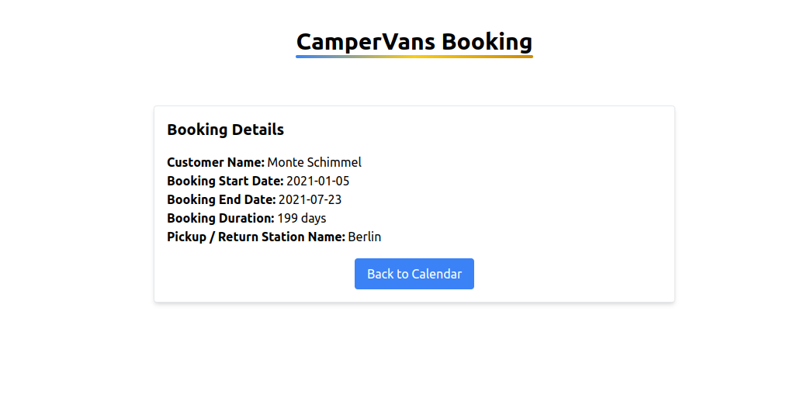
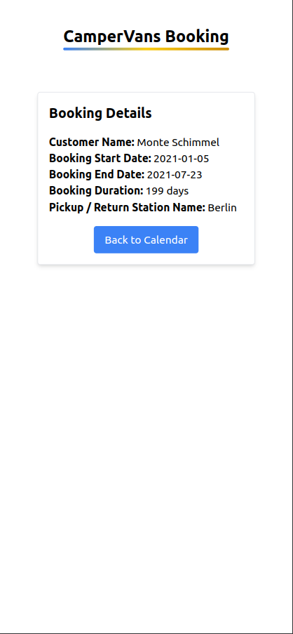
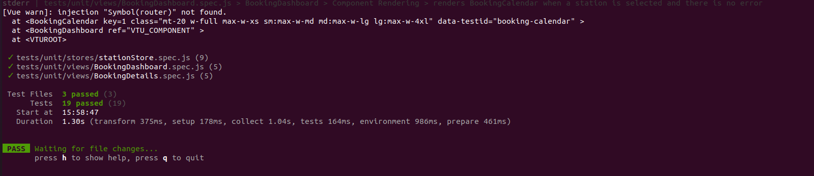

# Campervan Booking Dashboard



## Introduction

This project is a calendar-like dashboard web application designed to help staff at a campervan rental business manage bookings efficiently. It visualizes planned campervan pickups and returns at various rental stations to enhance workflow and transparency.

## Live Site

You can visit the live site here: [Campervan booking app](https://zohaibshahzadkhan.github.io/Campervans-booking-dashboard/)

## Technologies Used

- **Framework**: Vue.js
- **Styling**: Tailwind CSS
- **Bundler**: Vite
- **Hosting**: GitHub Pages
- **Testing**: Vitest
- **Formatting and Linting**: Es-lint, Prettier

## Branches

This project uses two primary branches:

- **`master`**: This branch contains the main codebase for the application. It includes all the features and functionalities of the web app.

- **`gh-pages`**: This branch is used for deployment to GitHub Pages. It contains additional configuration and build artifacts necessary for hosting the application on GitHub Pages.

When deploying the application, the `gh-pages` branch is used to serve the built version of the app.

## Data and Visualization

The data provided by the API is from the year 2021. The example data in the application demonstrates how to visualize this historical information. Here’s how to interact with the data:

- **Select the Station**: Choose "Berlin" from the station selector.
- **Set the Year**: Set the year to 2021.
- **Choose the Month**: Select the month of July.
- **View Bookings**: The week view will display bookings for the selected period.
- **See Booking Details**: You will see the names of individuals who have booked campervans during that week. Clicking on a booking will navigate you to a detailed view of that specific booking.

- **Week Navigation**: Use the "Previous" and "Next" buttons to switch between weeks in the calendar view.

Below are screenshots showcasing the desktop and mobile views of the application.











## Unit Testing

This project includes unit tests to ensure the functionality and reliability of the code. The tests are written using Vitest. Follow the instructions below to run the tests:

1. **Install Dependencies**: Ensure that you have installed all necessary dependencies, including the testing libraries. If you haven't already, run:
   ```bash
   npm install

2. **Run tests**:
   ```bash
   npm run test



## Setup


1. **Clone the Repository**:
   ```bash
   git clone https://github.com/zohaibshahzadkhan/Campervans-booking-dashboard.git
   cd campervan-booking-dashboard
   ```
2. **Setup**:
   ```bash 
   npm install

3. **Run the Application**:
   ```bash 
   npm run dev 

4. **Build/ Deploy**:
   ```bash 
   npm run build
   npm run deploy

5. **Run Linter and formatter**:
   ```bash 
   npm run lint
   npm run lint:fix
   npm run format
